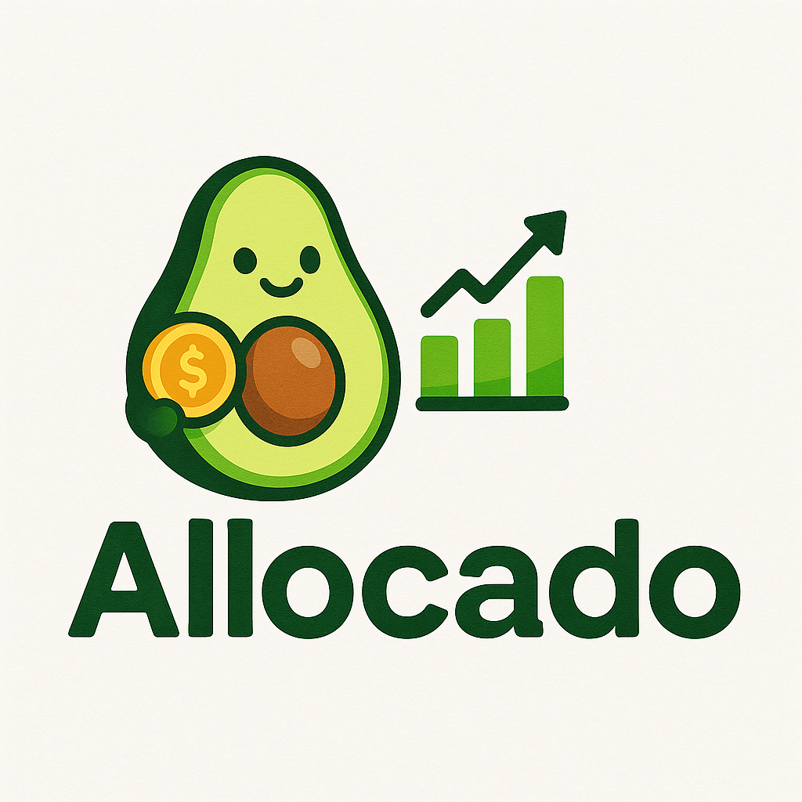

# Allocado

**Goals-based asset allocation tracking across multiple accounts and brokerages.**



---

Most portfolio tools show allocation across your entire net worth. Allocado is different — it groups your accounts by *goal* (Retirement, House, Car, etc.) so you can see whether each goal's allocation is on target independently, even when the underlying accounts are spread across multiple brokerages.

## Features

- **Goals-based view** — group accounts (Roth IRA, 401k, HSA, taxable) under a savings goal and track allocation per goal
- **Multi-class assets** — funds like VT automatically roll up into their component asset classes (60% US equity, 40% international) for accurate allocation math
- **Drift analysis** — see current vs. target allocation at a glance, with overage/underage per asset class
- **Bond duration tracking** — weighted average duration per goal, flagged against your time horizon
- **Rebalancing suggestions** — specific trades to get back to target
- **Glide path support** — scheduled target shifts as a goal's time horizon shortens

## Stack

- [Next.js](https://nextjs.org/) + TypeScript + [Tailwind CSS](https://tailwindcss.com/)
- [Clerk](https://clerk.com/) for auth
- [Drizzle ORM](https://orm.drizzle.team/) + [Neon](https://neon.tech/) (Postgres)
- [TanStack Query](https://tanstack.com/query)
- [Bun](https://bun.sh/)

## Getting started

```sh
# Install dependencies
bun install

# Set up environment variables
cp .env.example .env
# Fill in CLERK and DATABASE_URL values

# Run database migrations
bun db:migrate

# Start dev server
bun dev
```

You'll need a [Clerk](https://clerk.com) account (free) and a [Neon](https://neon.tech) Postgres database (free tier).
